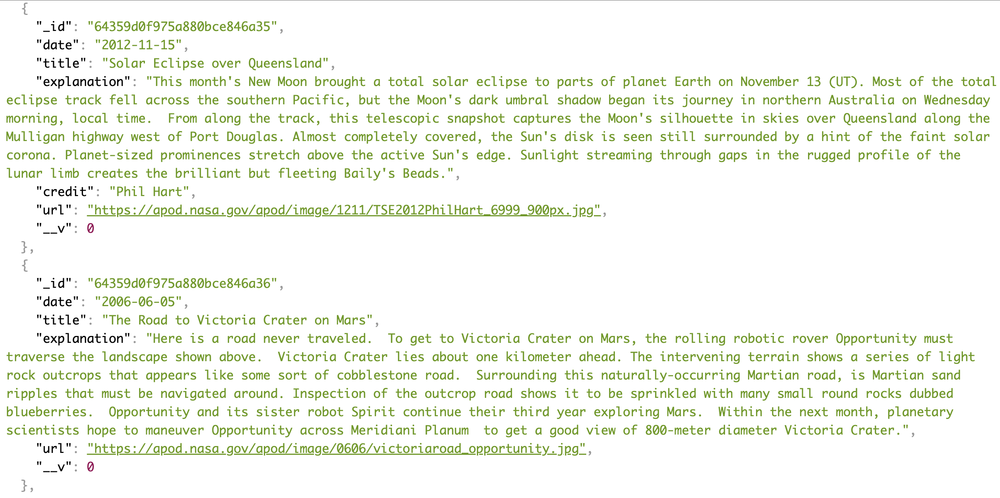
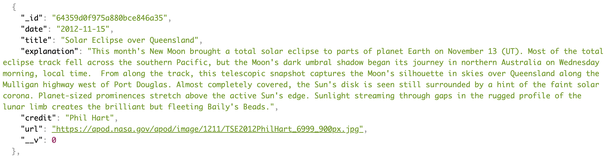

# NASA APOD API-Project

## Description

🚀 The Astronomy Picture of the Day (APOD) is based upon work supported by NASA. Originated, written, coordinated, and edited since 1995 by Robert Nemiroff and Jerry Bonnell, the APOD arcive contains the largest collection of annotated astronomical images on the internet! 🪐

Why NASA? I find those in this trade inspiring and wanted to explore their work with this API.  

                   

🌑  ★      •　°    ✯  ★     🛸  🌎　°　　🌓　
⭐️       .       .    ☄   ★     ★      .
     •　　.°•　　🚀 ✯ ⭐️　★　*　　★　　°　　💫　　🛰 　°
     ·　　          .　　　•　° ★　•  ☄ ⭐️•
     　° ★ •　° ★  ⭐️   🪐        .°•         💫

## Object Content

    { 
        "date": "string",
        "title": "string",
        "explanation": "string"",
        "credit": "string",
        "url": "string",
    }

## Installation
- Text editor of your choice [VSCODE](https://code.visualstudio.com/Download)

* [Postman](https://www.postman.com/downloads/) Platform for building and using API's

## Run
- Fork and git clone this repository

In the terminal, run:
- npm start
- npm run dev
- 

## API Get Endpoints Examples

**Request: A request with no parameters**
will return all astronomy picture of the day data: 

link: api-project-production-9de8.up.railway.app/astronomy

**Response**:

**Request: A request by ID** will return an object specific of that ID: 

link: api-project-production-9de8.up.railway.app/astronomy/:id/(objectID number)

_OR_

**Request: A request by Date** will return an object specified for entered date:

link: api-project-production-9de8.up.railway.app/astronomy/:date/2015-04-21

**Response**

## CRUD Implementation 

**GET** using Postman:

1. link
2. 
3. 

**CREATE** using Postman:

1. https://api-project-production-9de8.up.railway.app/astronomy ?
2. switch the endpoint to POST
3. click Body
4. click raw and its type to JSON
5. utilize the object above to create

**UPDATE** using Postman:

1. link
2. switch the endpoint to PUT
3. 

**DELETE** using Postman:
1. link
2. switch the endpoint to DELETE
3. 

## Credit
APOD
- [Github](https://github.com/nasa/apod-api)
* [NASA](https://api.nasa.gov/)

